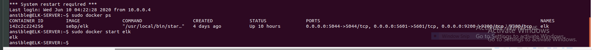
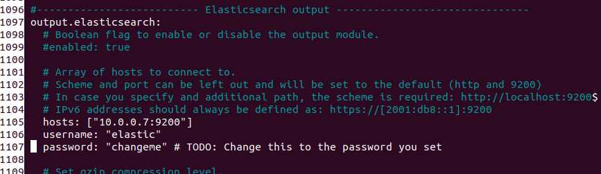
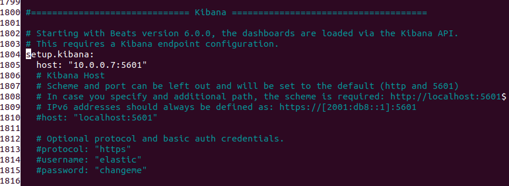

# ELKSTACKPROJECT

This document contains the following details:
Description of the Topology
Access Policies
How to Use the Ansible Build
ELK Configuration
  Beats in Use
  Filebeat
Metricbeat
Redundancy

Description of the Topology
The main purpose of this network is to expose a load-balanced and monitored instance of DVWA, the Damn Vulnerable Web Application.

Jump box
	Region: East US
	Private IP: 10.0.0.4
	Public IP (Static): 13.90.72.120
DVWA-VM1
	Region: East US (1)
	Availability zone: 1
	Private IP: 10.0.0.5
DVWA-VM2 (1)
	Region: East US
	Availability zone: 1
	Private IP: 10.0.0.6
ELK-SERVER (1)
	Region: East US
	Availability zone: 2
	Private IP: 10.0.0.7
DVWA-VM4
	Region: East US 2
	Availability zone: 3
	Private IP: 10.1.0.4
Firewall
Add whitelist of IPs
Inbound rules to only allow the IP in the whitelist access the jump box external network
Load Balancer
Fronted IP configuration: 52.186.98.223
Backend pools: DVWA-VM1, DVWA-VM2 and ELK-SERVER
Health probes: this helps load balancer to detect failure of an application added to a backend endpoint

**Load balancer rules: open port 80 for HTTP

Load balancing ensures that the application will be highly available, in addition to restricting traffic to the network.
Load balancer is an application that helps to efficiently distribute incoming traffic across all the backend servers. This backend server is also known as backend pool. Load balancer is also used to manage traffic across a region. This helps the organization to defend against distributed denial-of-service (DDoS) attack by rerouting heavy traffic from one server to another to eliminate single points of failure, reduce attack surface thereby making it harder for resources and saturate links exhaustion. 

**Jump-Box

Jump box serves as a gateway that allows all traffic to pass through it. This helps to secure and monitor the packets going into the VMs. This is achieved through the use of SSH port (22) to allow all traffic go through the Jump-Box. The jump box helps to prevent the exposure of VMs to the public from direct access.

The Jump Box is set up just like a virtual machine but the inbound policies which allows or blocks specific traffic are set. 

1. The public key was generated using the command "ssh-keygen" and the generated public key was later cat out using the command "cat ~/.ssh/id_rsa.pub". 

2. The inbound rules for traffic are created using the security group settings to either allow or block traffic from a specific port or IP address.

3. The public IP address was used to SSH to the terminal in order to create a gateway for the VMs

	Integrating an ELK server allows users to easily monitor the vulnerable VMs for changes to the infrastructure and system logs.
Filebeat monitors log files from the location that's been specified, collect these logs events and forwards the logs to elasticsearch or logstash for indexing
Metricbeat is installed on the server to periodically collect metric and statistics from operating system and all the services running on the server and ship to output (elasticsearch or logstash)

The configuration details of each machine may be found below

|Name    |Function   |IP Address   |Operating System   |
|--------|-----------|-------------|-------------------|
|Jump-Box|Gateway    |10.0.0.4     | Linux             |
|DVMA-VM1|Webserver  |10.0.0.5     | Linux             |
|DVMA-VM1|Webserver  |10.0.0.6     | Linux             |
|ELKSERVE|ELK server |10.0.0.7     | Linux             |
|DVWA-VM4|Webserver  |10.1.0.4     | Linux             |

## Access Policies

The machines on the internal network are not exposed to the public Internet. 

Only the Jump-Box (public IP address: 13.90.72.120) machine can accept connections from the Internet. Access to this machine is only allowed from the following IP addresses:
10.0.0.5, 10.0.0.6, 10.0.0.7 and 10.1.0.4

Machines within the network can only be accessed by the jump box and other machines in the network.

A summary of the access policies in place can be found in the table below.
 
| Name   | Publicly Accessible  | Allowed IP address   |
|--------|----------------------|----------------------|
|Jump box|     yes              |    Whitelist IP      |
|DVWA-VM1|     yes              |    any               |
|DVWA-VM2|     yes              |    any               |
|ELKSERV |     yes              |10.0.0.4, 10.0.0.5    |
|        |                      |10.0.0.6 10.1.0.4     |
|DVWA-VM4|     yes              |     any              |

 ## How to use the Ansible Build Automated Deployment

Before one can use Ansible, we must SSH into the jump box where we can now start and launch a docker container. 

Create a new SSH key and copy the public key (in the terminal)
Run ssh-keygen to generate a SSH key
Run cat .ssh/id_rsa.pub to view and be able to copy the SSH key generated
Copy the public key string

Return to the Azure portal and create a VM. (Kindly follow the necessary instruction required to create a VM, consider the region for time zone, Availability option to select either site or zone and many other necessary parameters to be considered based on the requirements to build a new VM)
Launch the newly created VM to test the connection by using SSH from the Jump box Ansible container. The following command can be run to test the connection.
	    ssh ansible@VM-private-IP
Note: This step allows you to enter into the newly created VM. connection can also be tested by using ping, this is possible if the TCP connections are enabled for SSH
Exit the VM after connection has been established.
After this step has been completed, locate the ansible config and host file from the path /etc/ansible to the VM’s IP address.
    Open the file hosts file by running this command “nano /etc/ansible/hosts” to register the IP
    Inside the hosts file, uncomment the [webservers]

Note: the IP address is added underneath the [webservers]

Navigate to the ansible configuration file under the path /etc/ansible to register the administrator account to enable SSH connection.
    Open the ansible config file by running this command nano /etc/ansible/ansible config and scroll down to remote_user 
     Uncomment the remote_user line and replace it with the VM admin username

Test ansible connection use by running the ansible command below. 
     ansible -m ping all

## Elk Configuration

Ansible was used to automate configuration of the ELK machine. No configuration was performed manually, which is advantageous because…
1. Idempotent: it can be used to deploy to many machines with the same settings
2. Free: It’s an open-source tool
3. No agent: Machines can be configured with ansible as long as the box can be ssh’d into
4. Declarative and not procedural: There’s no specific pattern to follow in configuration because ansible works by the description given for the state of the machine you want.
5. Simple: ansible uses a simple syntax written in YAML called playbooks. This’s simple as it contains no special coding that requires an IT professional
6. Efficient: its efficiency stems from the fact that it does not require extra software on the servers which means, no extra resources will be required.

1. Create a new VM as ELK server
2. Downloading and configuring the container
      We created a playbook to implement the following tasks

      The header of the ansible playbook can be used to specify the specific machine we’re targeting and the remote_user
    - name: Config elk VM with Docker
        hosts: elkservers
        remote\_user: elk
        become: true
        tasks:
  There’s need to increase the memory of the VM, this enables excellent and efficient performance of  the machines
        sysctl -w vm.max_map_count=262144

  The playbook should install the following services
      Docker.io
      Python-pip
      Docker python module
The screenshot below shows the result after successfully configured elk server
3. Launching and exposing the container
      The container should be ran with these published ports for different functions 
	     5601:5601
	     9200:9200
	     5044:5044
    SSH from your ansible container to your ELk using the elk server private IP address to verify connection or ping the elkserver private IP to confirm it’s receiving packets.
    Run the playbook (install-elk.yml) and then SSH into the ELK container and verify its installation by running sudo docker ps.
The following screenshot displays the result of running `docker ps` after successfully configuring the ELK instance.

4. An inbound rule was created using the security group to allow TCP traffic over port 5601 (unique port for kibana) from the host public IP address, 73.43.248.239 (generated from IP chicken)

## Target Machines & Beats

This ELK server is configured to monitor the following machines:
The IP addresses of the machines the ELK server is monitoring 
DVWA-VM1: 10.0.0.5
DVWA-VM2: 10.0.0.6
DVWA-VM4: 10.1.0.4
We have installed the following Beats on these machines:
Filebeat on DVWA-VM1 and DVWA-VM2
Metricbeat on DVWA-VM1, DVWA-VM2 and DVWA-VM4

## Webserver Deployment

YAML playbook file was used to create ansible playbook to install docker and configure VMs with DVWA web app

Create a YAML playbook file that will be used for web app configuration
    The playbook files are located under the path /etc/ansible/webserver-playbook.yml
    Use the Ansible apt module to install docker.io and python-pip
 - name: docker.io
    apt:
    force_apt_get: yes
    name: docker.io
    state: present
 
  - name: Install pip
    apt:
    force_apt_get: yes
    name: python-pip
    state: present"
    
    Use Ansible pip module to install docker
- name: Install Docker python module
          pip:
            name: docker
            state: present
            
    Use ansible docker-container module to install the cyberxsecurity/dvwa container
 - name: download and launch a docker web container
    docker\_container:
      name: dvwa
      image: cyberxsecurity/dvwa
      state: started
      published\_ports: 80:80
      
    Run the ansible playbook on the webservers VMs

        sudo ansible-playbook /etc/ansible/webserver-playbook.yml

    To test that the playbook has been loaded to the webserver VMs by using SSH and the private IP address
        ssh ansible-VM-name@new-VM-IP

    Run the following command to confirm or test the connection if it’s working fine, this can be confirmed with the presence of some HTML from the DVWA container
        curl localhost/setup.php

## Filebeat Deployment
To setup the filebeat, the filebeat configuration and playbook will be required

1. Install filebeat on DVWA-VM3 (Elk-server) container, this can be achieved by making sure the ELK container is up and running
  
  Navigate to http://[VM public IP]:5601 (public IP address of the ELK-Server)

NOTE: Sometimes the kibana page doesn’t come up, this can be achieved by opening a terminal and run the following command

Run sudo docker ps to confirm if the container is up and running, and if the docker container is not running, kindly run this command to start up the container sudo docker start elk

2. Creating filebeat configuration file

This step requires setting up the configuration file through editing for the correct settings to allow work with the ELK server.

Open the terminal and SSH into the jump box

Start up an ansible container and SSH into Ansible container

Make sure the filebeat configuration file is edited to match the provided template configuration file. 

NOTE: The DVWA that will be connected to isthe ELK server, hence, the configuration file will include the ELK-server’s private IP address

After making these editions, save the file in /etc/ansible/files/filebeat-configuration.yml

3. Create a filebeat installation playbook

Create another Ansible playbook that accomplishes the Linux Filebeat installation instructions
  
  The playbook should: Download the filebeat.deb file using this link 
  
  curl -L -O https://artifacts.elastic.co/downloads/beats/filebeat/filebeat-7.7.1-amd64.deb

Install the .deb file using the dpkg command:
    dpkg -i filebeat-7.7.1-amd64.deb

Copy the filebeat configuration file from your ansible container to your webserver VMs

You can use the ansible module to copy the entire configuration file into the correct place

The configuration file was placed in filebeat directory

Run the command "filebeat modules enable system" to enable and configure system module

Run the command "filebeat setup" to setup filebeat

Run the command "service filebeat start" to start the filebeat service

Run the command "ansible-playbook /etc/ansible/filebeat/filebeat-playbook.yml" to deploy the filebeat to DVWA-VM1 and DVWA-VM2

  
4. Verifying Installation and Playbook

We need to confirm that the ELK server is receiving logs from the webservers.
   
   Verify that your playbook is completing steps 1-4
   
   On the same page, scroll to step 5: Module Status and click Check Data (this is found at the bottom of the page). This helps to verify the incoming data from the webservers

## Metricbeat Deployment

The configuration of metricbeat is similar to filebeat except their individual function. The metricbeat template configuration file provided is used to configure the metricbeat-playbook.yml file.

1. Installing metricbeat on DVWA containers

The ELK server must be up and running and this can be achieved with the same steps as above in the filebeat configuration.

Install Metricbeat on the DVWA VMs

Open your ELK server homepage
    
    Click on Add Metric Data
    
    Choose Docker Metrics
    
    Click on the DEB tab under Getting Started to view the correct Linux Metricbeat installation instructions

2. Creating the metricbeat configuration file

This step requires setting up the configuration file through editing for the correct settings to allow work with the ELK server.

Open the terminal and SSH into the jump box

Start up an ansible container and SSH into Ansible container

Make sure the metricbeat configuration file is edited to match the provided template configuration file.

After making these editions, save the file in /etc/ansible/files/metricbeat-configuration.yml

3. Create a metricbeat installation play

Create another Ansible playbook that accomplishes the Linux metricbeat installation instructions
  
  The playbook should:Download the metricbeat.deb file by using this link 
  
  curl -L -O https://artifacts.elastic.co/downloads/beats/metricbeat/metricbeat-7.7.1-amd64.deb 

Install the .deb file using the dpkg command:  dpkg -i metricbeat-7.7.1-amd64.deb

Copy the filebeat configuration file from your ansible container to your webserver VMs

You can use the ansible module to copy the entire configuration file into the correct place

The configuration file was placed in filebeat directory

Run the command "filebeat modules enable system" to enable and configure system module

Run the command "filebeat setup" to setup filebeat

Run the command "service filebeat start" to start the filebeat service

Run the command "ansible-playbook /etc/ansible/filebeat/filebeat-playbook.yml" to deploy the filebeat to DVWA-VM1 and DVWA-VM2

4. Verifying Installation and Playbook

We need to confirm that the ELK server is receiving logs from the webservers.
    
    Verify that your playbook is completing steps 1-4
    
    On the same page, scroll to step 5: Module Status and click Check Data (this is found at the bottom of the page). This helps to verify the incoming data from the webservers

## Redundancy Testing

Redundancy is to determine the availability of VMs incase one is down, the other one should be up running. This create a backup for any machine that goes down since all the webserver contain the same applications and run the same program. 

Testing Redundancy for VM1 and VM2

Testing the redundancy by switching off VM2 and running VM1 to see if the DVWA will still be running

Testing redundancy by switching of VM1 and VM2

Kindly note that the public IP used to launch the DVWA is that of the load balancer (52.186.98.223) as both DVWA-VM1 and DVWA-VM2 are present on the load balance and contain the same webservers playbook YAML file.
